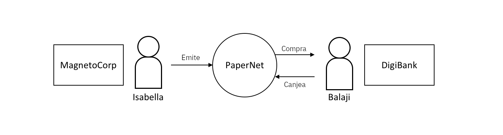

# Creando una Solución más Compleja

## Introducción
Este laboratorio le mostrará cómo instalar y utilizar una aplicación de ejemplo de papel comercial y un contrato inteligente. Debido a que este laboratorio está  orientado a las tareas y no tanto a los conceptos, resulta de suma importancia que si existe una duda conceptual esta sea externada al instructor.

En este tutorial, dos organizaciones __MagenetoCorp__ y __DigiBank__ intercambiarán papel comercial entre ellas usando __PaperNet__, una red Blockchain basada en Hyperledger Fabric, que crearemos para efecto de este ejercicio.

En esta red existirán diversos perfiles por lo que primero actuaremos como Isabella, una empleada de __MagnetoCorp__, que emitirá el papel comercial que fungirá como el activo de valor. Luego cambiaremos de usuario, y participaremos como Balaji, empleado de __DigiBank__ que comprará dico papel comercial y luego, después de retenerlo un tiempo, lo canjeará de regreso con __MagnetoCorp__ por una pequeña utilidad.