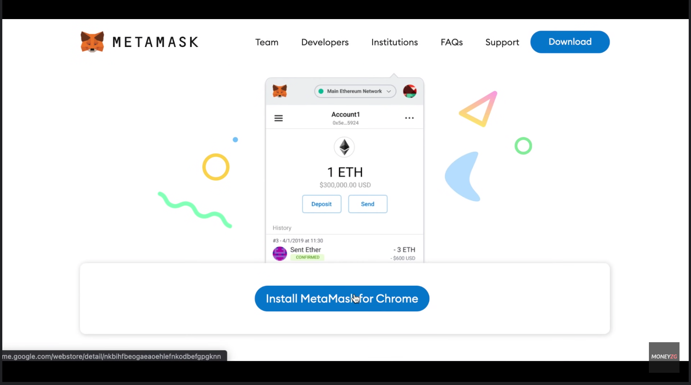

# Preparación

## Introducción

Curiosamente, iniciaremos por preparar nuestro ambiente para la última práctica primero, esto derivado a que es lo que más tiempo puede tomar. No hay que apurarnos pues es una intalación sencilla. Sólo consume tiempo

## 1 - Instalación de Metamask

Para la parte de la sesión en donde trabajaremos con criptomonedas, es esencial descargar Metamask, el cual es una billetera digital bastante conocida. Para poder instalarlo, primero navegamos a la siguiente dirección (https://metamask.io/download/) ahi seleccionaremos la versión que nos convenga, sin embargo para esta práctica, conviene que sea una versión instalada en nuestro navegador.

Esta instalación dejará listo metamask como un accesorio de nuestro navegador. En este caso asumiré que estamos usando chrome por lo que doy click a instalar 

 