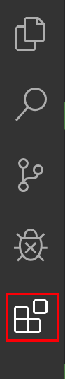
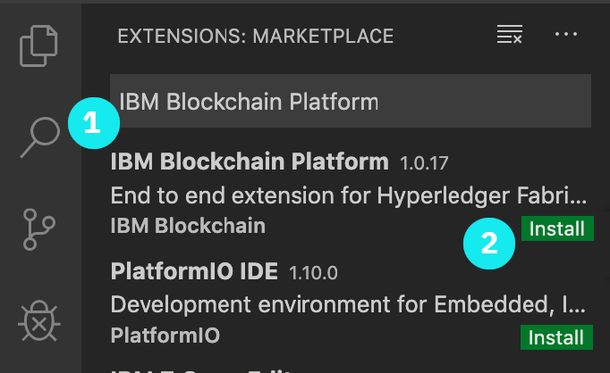
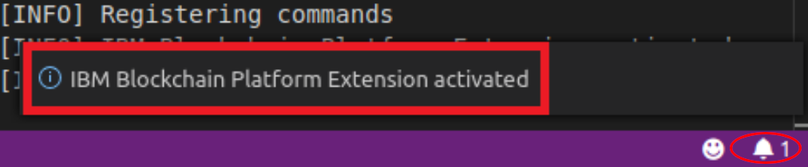

# Laboratorio 01 - Preparando nuestro entorno

## Introducción

El objeto de este laboratorio es sumamente simple, prepararemos nuestras computadoras para tener un ambiente local de desarrollo. En concreto, prepararemos los siguientes componentes dentro de nuestra máquina:

- __Node.js__ : Plataforma para ejecución de programas en el lenguage javascript.
- __Visual Studio Code__ : Editor de texto avanzado, pensado para el desarrollo de programas.
- __Docker__ : Entorno de contenedores, encargado de la gestión de herrmientas de software para la creación de ambientes.
- __IBM Blockchain Visual Studio Code Extension__ componente accesorio gratuito para visual studio code para controlar y desplegar código a la plaraforma de Hyperledger Fabric.

## 1 - Acceder a la línea de comando

Todas nuestras máquinas cuentan con una terminal desde donde podemos controlar y ejecutar programas desde la linea de comando. Para usar la terminal debemos hacer lo siguiente, dependiendo de nuestro sistema operativo:

1. En __Windows__ en nuestra barra de programas, seleccionar la opción "ejecutar" (opcionalmente tecleear _cmd+r__) y en el campo que se muestra escribir la instrucción __cmd__ y teclar la tecla de __Intro__
2. Bajo __OS X__ tienes dos opciones
    1. Haz clic en el ícono de Launchpad en el Dock, escribe Terminal en el campo de búsqueda y haz clic en Terminal.
    2. En el Finder , abre la carpeta /Aplicaciones/Utilidades, y haz doble clic en Terminal.

## 2 - Instalar Node.js

Lo primero que haremos, será revisar si ya tenemos Node.js instalado, escribiendo la siguiente instrucción y finalizando con la tecla de __Intro__

```
node -v
```
En caso de que Node se encuentre instalado, esto mostrará la versión instalada. Para ejecutar los ejercicios necesitamos tener la versión 8.16 o superior.

En caso de que esta instrucción muestre un error o bien que la versión sea una versión anterior, deberemos ir a la siguiente dirección https://nodejs.org/en/download/ en donde seleccionaremos el instalador correspondiente a nuestro sistema operativo. Una vez descargado el instalador lo ejecutamos con sus opciones por omisión.

## 3 - Instalar Visual Studio Code

El Visual Studio Code es un editor de texto ideal para la creación de programas. Para poder descargarlo debemos entrar a https://code.visualstudio.com/ y seleccionar nuestro sistema operativo. Descargamos el instalador y ejecutamos la instalación por omisión.

## 4 - Instalar Docker 

Docker es una plataforma de contenedores que sirve para desplegar plataformas de desarrollo y ejecución de soluciones. Para instalarlo debemos de seguir las siguientes instrucciones dependiendo de nuestra plataforma:

- __Windows 10 Home__
    - Debemos navegar a https://hub.docker.com/editions/community/docker-ce-desktop-windows/ y una vez ahí dar click en el botón 
    - Luego de descargarlo, debemos ejecutar el instalador, si se nos pregunta, debemos asegurarnos de habilitar las opciones para habilitar las opciones de __WSL 2__
    - Una vez ejecutada y finalizada la instalación, __Docker Desktop__ debe ejecutar, esto lo podemos saber pues aparecerá el siguiente icono en la barra de notificaciones 
    - Si al finalizar la instalación __Docker Desktop__ no inicia automáticamente, debemos iniciarlo manualmente buscando docker entre nuestras aplicaciones y seleccionando la opción __Docker Desktop__ entre nuestros resultados como se muestra a continuacion : 
- __Windows 10 Pro, Enterprise, o Education__
    - Debemos navegar a https://hub.docker.com/editions/community/docker-ce-desktop-windows/ y una vez ahí dar click en el botón 
    - Luego de descargarlo, debemos ejecutar el instalador, si se nos pregunta, debemos asegurarnos de habilitar las opciones para habilitar las opciones de __Hyper-V__
    - Una vez ejecutada y finalizada la instalación, __Docker Desktop__ debe ejecutar, esto lo podemos saber pues aparecerá el siguiente icono en la barra de notificaciones 
    - Si al finalizar la instalación __Docker Desktop__ no inicia automáticamente, debemos iniciarlo manualmente buscando docker entre nuestras aplicaciones y seleccionando la opción __Docker Desktop__ entre nuestros resultados como se muestra a continuacion : 
- __OS X__ 
    - Debemos navegar a https://hub.docker.com/editions/community/docker-ce-desktop-mac/ y una vez ahí dar click en el botón 
    - Una vez descargado, debemos dar doble click sobre el archivo descargado lo que abrirá la ventana de instalación. Una vez hecho esto debemos arrastrar el Icono de docker sobre del icono de aplicaciones y dejarlo ahi de la siguiente forma: 
    - Una vez hecho esto el programa quedará instalado y lo podemos ver de la siguiente forma en nuestro folder de aplicaciones: 
    - Demos doble click sobre su Icono para iniciar el aplicativo (esto será necesario solo la primera vez)
    - Una vez que está ejecutando, lo podemos ver mediante el Icono de la ballena en nuestra barra de menú de la siguente manera: 


## 5 - Instalar el IBM Blockchain Visual Studio Code Extension

Lo primero que debemos hacer es iniciar el programa Visual Studio Code que instalamos en el paso 3 de la manera normal en que ejecutamos programas en nuestro sistema operativo. Una vez iniciado, debemos dar click sobre el Icono de extensiones que aparece en el menú izquierdo de la siguiente manera:



Una vez hecho esto, debemos escribir en el campo de búsqueda la frase __IBM Blockchain Platform__ y dar click en la opción correspondiente para instalar entre los resultados de la busqueda de la siguiente manera:



Luego de seleccionar instalar, pasarán unos segundos y deberemos ver una notificación informándonos que la extensión se encuentra instalada:



Una vez que hemos terminado, el menú izquierdo ahora mostrará un Icono para el IBM Blockchain Platform:


## 6 - Fin

Felicidades! Has terminado el primer laboratorio del curso. Tu máquina se encuentra lista para desarrollar soluciones blockchain.
