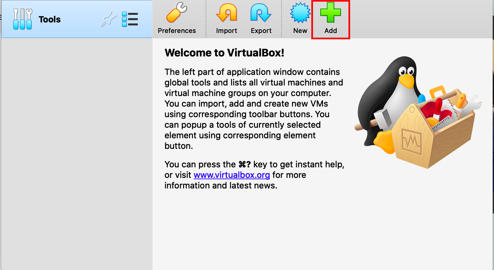
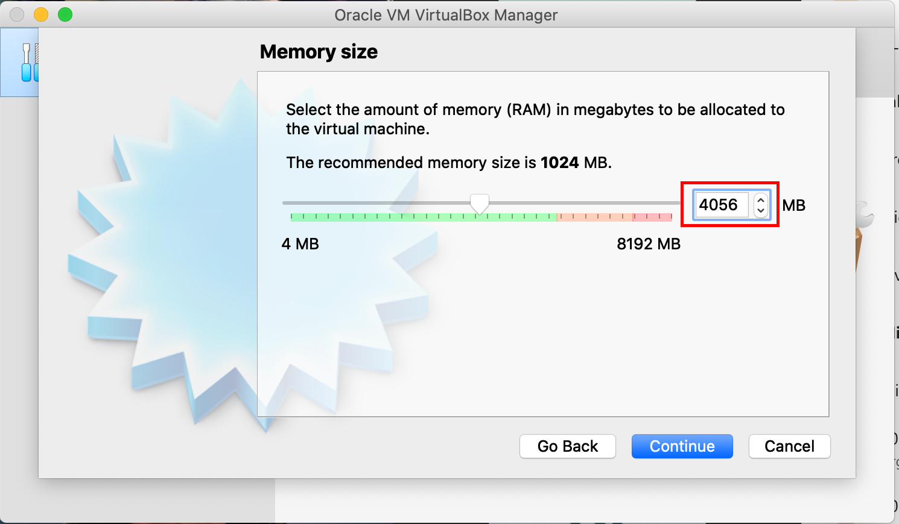
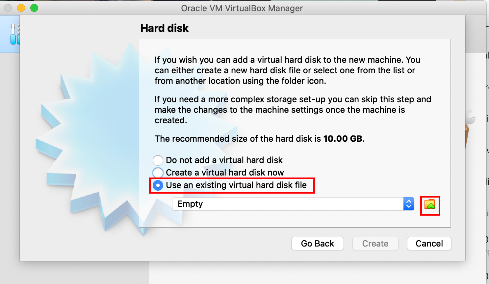
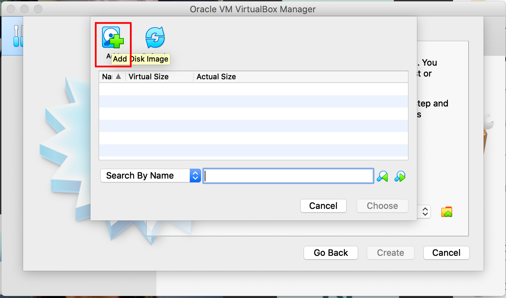
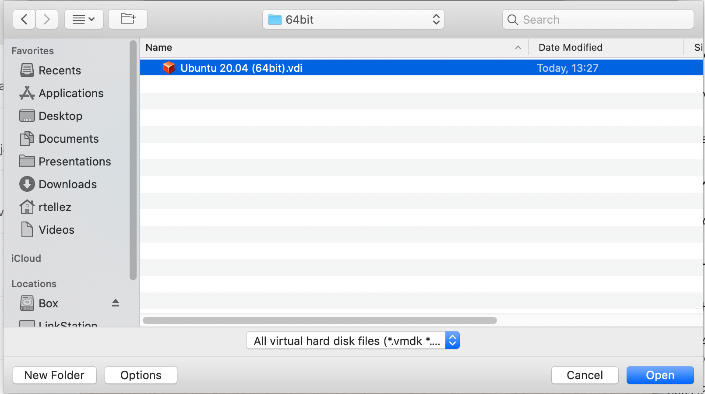
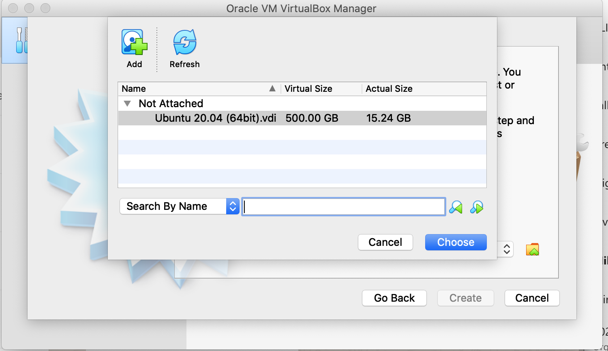
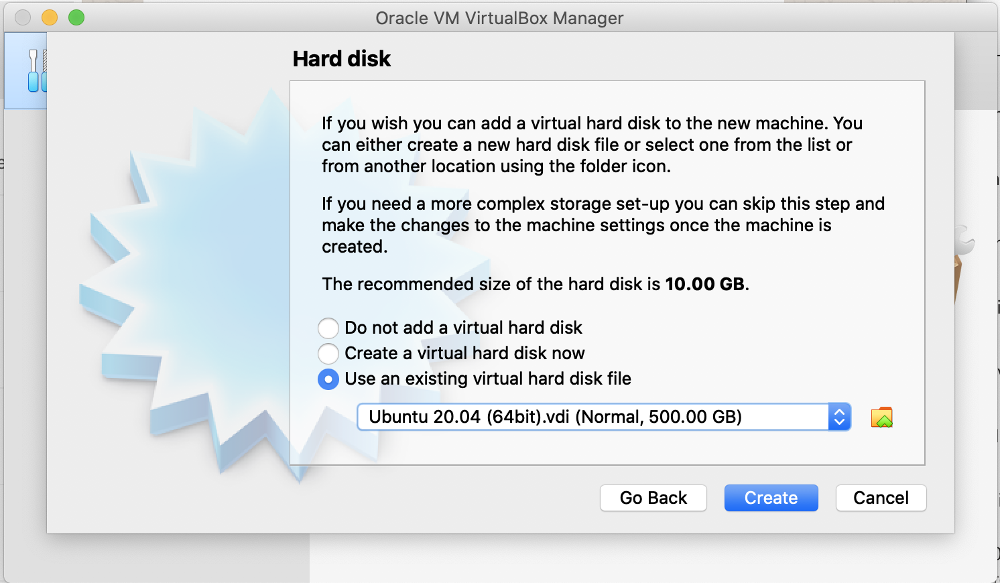
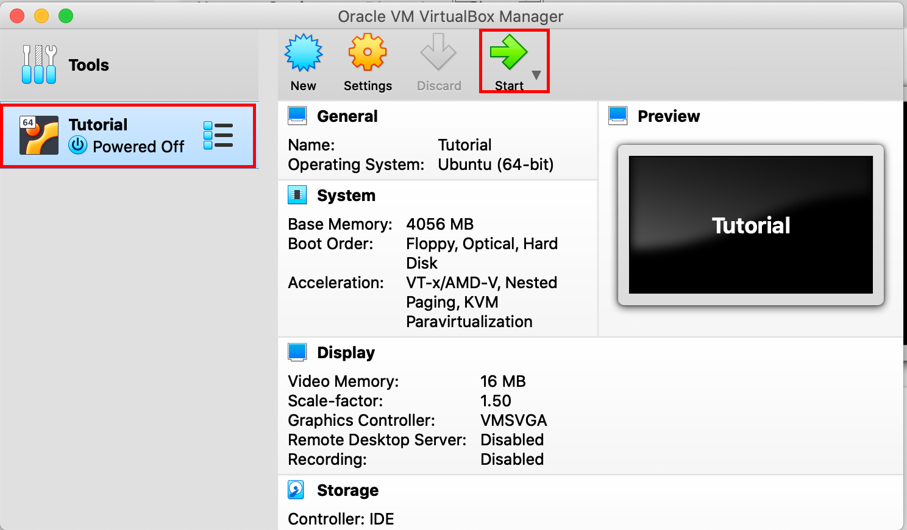
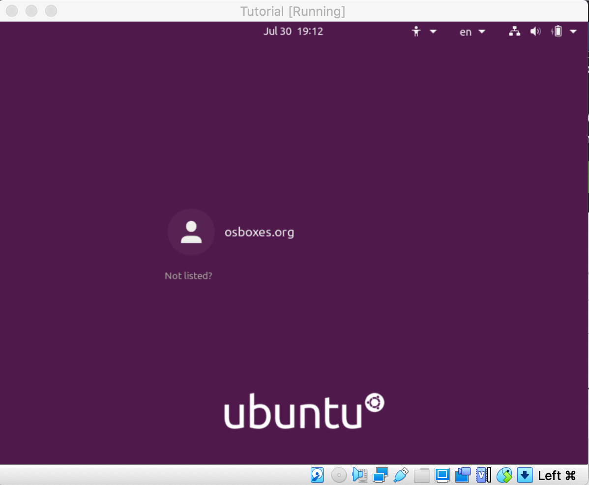
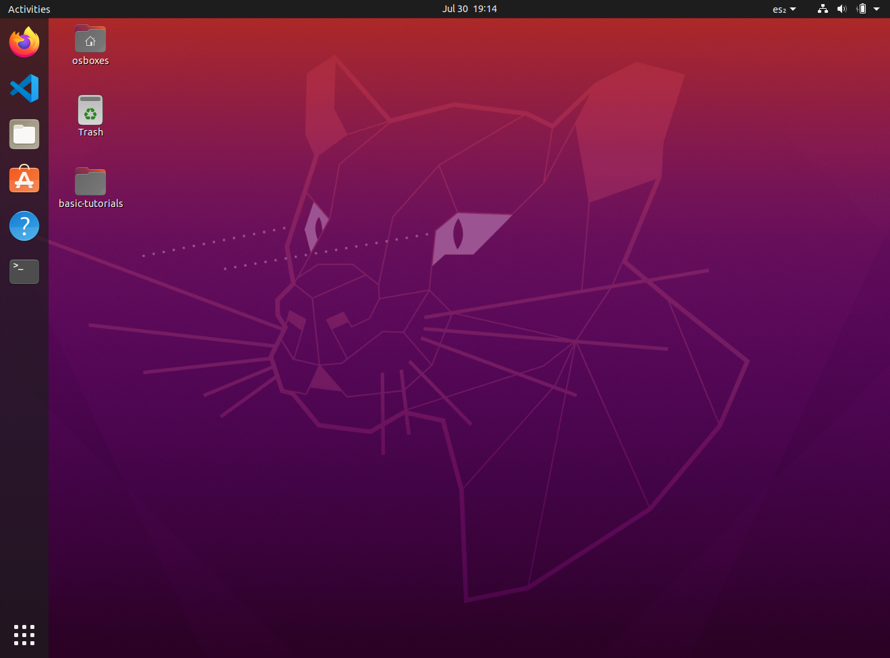

# Laboratorio 01 - Preparando nuestro entorno

## Introducción

Este laboratorio consiste en una alternativa para la preparación de un ambiente para la ejecución de los demás laboratorios. Esta alternativa puede ser usada en lugar de la establecida en el [laboratorio 01](./laboratorio_01.md).

__Ventajas y Desventajas__ : La gran ventaja de esta alternativa es que requiere una menor cantidad de instalación ya que proporciona un ambiente pre configurado y probado. Su gran desventaja es la cantidad de espacio que consume en disco  ya que consume cerca de 16 GB de almacenamiento.

## 1 - Instalación del software de virtualización

Para ejecutar la máquina virtual, primero requerimos de instalar un software de virtualización que ejecutará nuestra máquina virtual. Para esto usaremos el __Oracle Virtual Box__ mismo que puede ser descargado de la [aquí](https://www.virtualbox.org/wiki/Downloads). En esta página debemos escoger la versión correspondiente a el sistema operativo de la maquina que tenemos.

Una vez descargada, realizamos la instalación con la opciones por omisión.

## 2 - Descarga de la máquina virtual

De manera separada a el software de virtualización, tenemos el archivo de nuestra máquina virtual. La máquina virtual puede ser descargada de [aquí](https://ibm.box.com/s/137duspbw1b9jtjlpw6oax8vvmh0zg4q).

Esta descarga puede tomar varios minutos pues se trata de un archivo grande (5.8 GB). Una vez descargado el archivo deberemos descomprimirlo quedando en unos 16.4 GBs. Luego de descomprimirlo, podemos borrar el archivo __MaquinaCurso.zip__ para recuperar espacio.

## 3 - Instalación de la máquina virtual

### Ejecutar VirtualBox

Si no lo tenemos corriendo aun, debemos abrir VirtualBox y una vez que está ejecutando debemos presionar el boton para agregar una máquina virtual

### Configurar los datos de la maquina vitual

En la ventana de diálogo que nos aparece, procedemos a capturar los siguiente datos: 

- En el campo de nombre (Name) ponemos Tutorial. 
- En el campo de tipo (Type) seleccionamos la opcion Linux
- En el campo de versión (Version) seleccionamos Ubuntu 64 Bits

Una vez hecho esto, presionamos el boton para continuar.

### Definir la cantidad de memoria

En la siguiente pantalla, debemos configurar la cantidad de memoria que consumirá la máquina virtual. Aquí es importante seleccionar 4 GB, osea 4,056 MB

Una vez hecho esto presionamos el boton para continuar

### Selección del disco

En la pantalla que se nos muestra para seleccionar el disco, debemo marcar que queremos usar un disco existente y luego presionar el boton con el icono de folder

Esto abrirá una nueva ventana de diálogo en donde presionaremos el botón de agregar

Finalmente esto abrirá una ventana de navegación de archivos y navegaremos en nuestra máquina para seleccionar el archivo resultante de la descompresión que ejecutamos en el paso 2 y presionamos el boton para abrir

Esto nos regresa a la ventana anterior pero con nuestro disco en la lista. Seleccionamos el disco y apretamos el boton de elegir

Esto nos regresa a la primera pantalla de selección del disco en donde se debe mostrar el disco que hemos configurado y terminamos el proceso apretando el botón de crear

### Ejecución de la maquina virtual

Si todos los pasos han sido exitosos, dentro de Virtual Box veremos nuestra maquina virtual enlistada en la pantalla. De momento la máquina está detenida, cuando necesitemos ejecutarla, deberemos seleccionarla en la lista y luego presionar el botón de inicio (flecha verde de la parte superior)

la primera ves podría tomar varios minutos iniciar la máquina, cuando la maquina ya está corriendo veremos en la ventana de la maquina la siguiente pantalla que nos pide que nos firmemos para entrar

Para entrar a la maquina, nuestro usuario es osboxes.org mismo que ya aparece en pantalla. En el campo de password volveremos a escribir osboxes.org y presionamos Intro

Si todo funciona bien, entraremos a nuestra máquina virtual que se muestra a continuación

