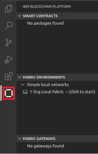
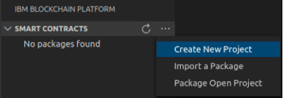
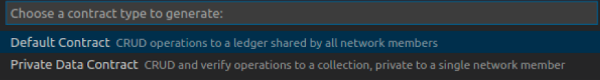
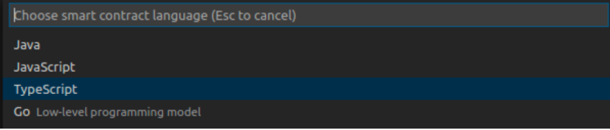
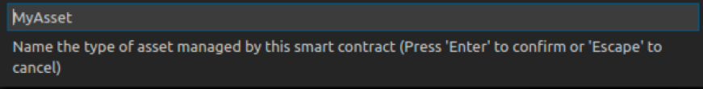
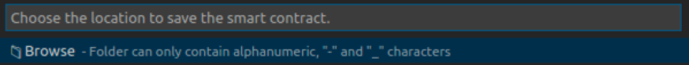

# Creando un Primer Contrato Inteligente

## 1 - Creando el Proyecto

Para poder trabajar los proyectos de contrato inteligente, deberemos abrir nuestro __Visual Studio Code__. Una vez dentro del programa, debemos seleccionar del menú del lado izquierdo la opción del IBM Blockchain Addon como se muestra a continuación:

Debemos tener cuidado en que se muestren las secciones de la herramienta (Smart Contracts, Fabric Environments, etc) ya que si volvemos a hacer click sobre la opción en el menú estas desaparecen o aparecen alternativamente.

Ahora, ya dentro de la herramienta, generaremos un nuevo conjunto de archivos para nuestra aplicación. Dentro de la sección __Smart Contracts__ debemos dar click sobre el icono marcado __"..."__, dentro del sub menú que aparecerá seleccionaremos la opción __"Create New Project"__ como se muestra a continuiación:

Al hacerlo nos aparecerá en la parte superior un nuevo diálogo. Presionaremos la tecla __Intro__ para aceptar la opción por omisión de la siguiente forma:

Acto seguido, aparacerá un nuevo díalogo preguntandonos por el lenguage de programación a usar en el proyecto. En esta ocasión seleccionaremos la opción __TypeScript__ de la siguiente manera

Estas opciones general el andamiaje básico para crear un contrato inteligente centrado sobre el manejo de un único tipo de activo. Luego de ejecutar la herramienta podremos agregar otros tipos de activo. Por ahora nombremos nuestro activo base como __MyAssett__ como se muestra a continuación:

Ahora la herramienta nos pregunta en donde deberemos crear el proyecto. Seleccionemos la opción __Browse__ para navegar en nuestro disco y seleccionar la ubicación donde crearemos nuestro proyecto

