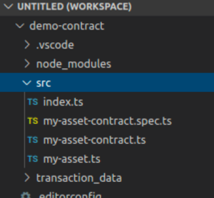
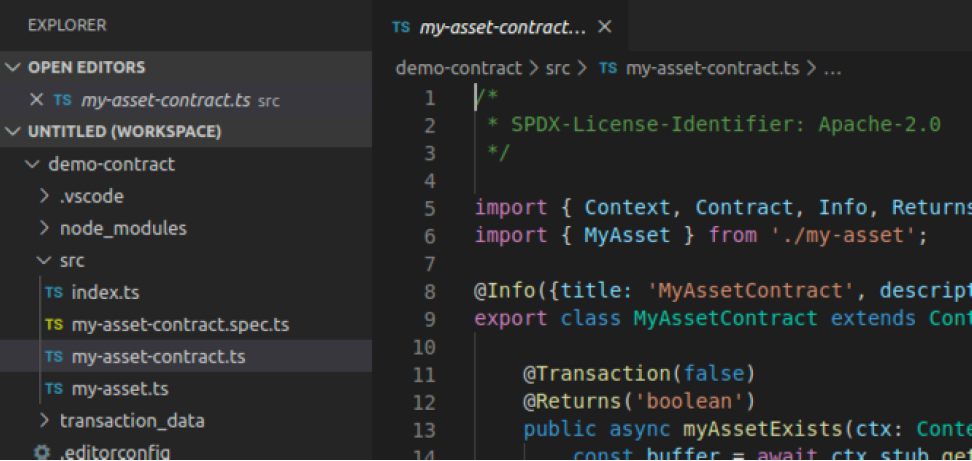

# Modificando un Contrato Inteligente

## 1 - Agregando una nueva función

Hemos hablado de como en el blockchain tenemos un registro histórico de las transacciones ejecutadas. Sin embargo, de momento sólo hemos visto como esas transacciones tienen efecto sobre los activos y no vemos la historia. En esta práctica modificaremos nuestro contrato inteligente para visualizar como uno de los activos cambia de valor en el tiempo.

## 2 - Modificamos el archivo de contrato

Navegamos via nuestro menú de archivos a la sección donde generamos la lógica de contrato en nuestra práctica pasad. Acto seguido expandimos la carpeta __src__ en donde la herramienta nos ha dejado el código fuente de nuestra aplicación de la siguiente forma:



Como posiblemente recuerdes, el contrato inteligente generado se encuentra dentro del archivo __my-asset-contract.ts__, demos un doble click sobre el archivo __my-asset-contract.ts__ para abrirlo en el editor de la siguiente forma



Navegamos justo despues de la función __deleteMyAsset__ y agregamos la siguiente función:

```javascript

```
como podemos ver esta función recibe como parámetro un identificador de activo, bajo la variable __myAssetId__ y manda llamar a la función interna __getHistoryForKey__ pasando el mismo parametro. Esta funcion interna nos regresa una colección con la totalidad de los movimientos que ha tenido un activo.

## 3 - Desplegando el contrato

Para desplegar el contrato, debemos realizar mas o menos las mismas funciones que realizamos durante la práctica anterior, sin embargo debemos de considerar que nos efrentamos a una nueva version del contrato. Por este motivo debemos tambien notificarle al blockchain que existe una nueva versión. Para tal motivo debemos abrir de nuestro menú de archivos el archivo llamado __package.json__.

Al abrirlo debemos encontrar la linea que indica
```json
"version": "0.0.1",
```
y debemos modificarlo a que diga en su lugar
```json
"version": "0.0.2",
```
Salvamos tanto __package.json__ como __my-asset-contract.ts__ y procedemos a deplegar el contrato. Una vez desplegado el contrato, intenta hacer pruebas modificando un activo varias veces y luego borrandolo. Ahora lanza la consulta a la función __showHistory__

