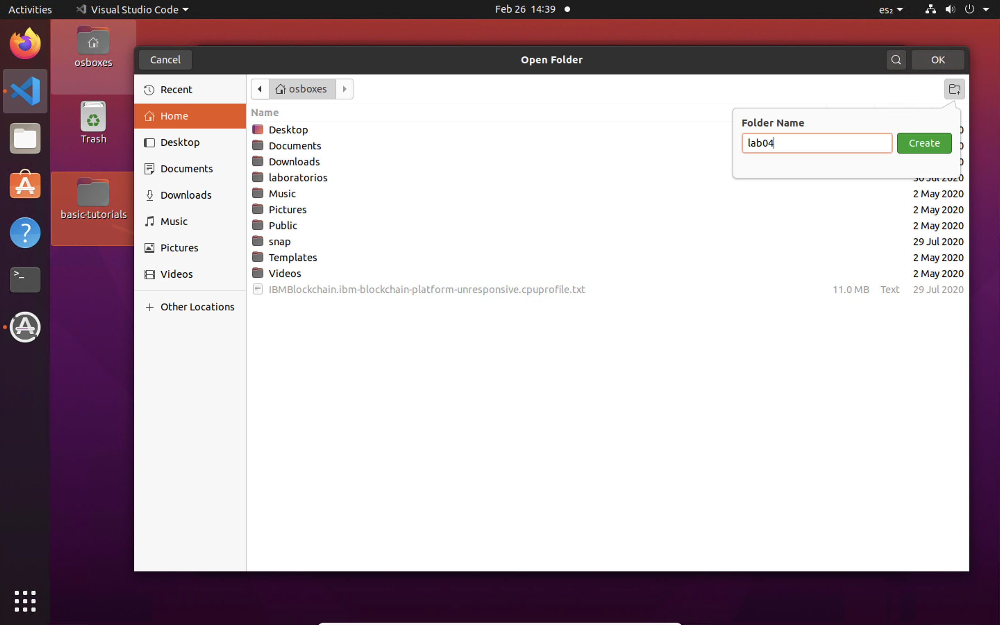
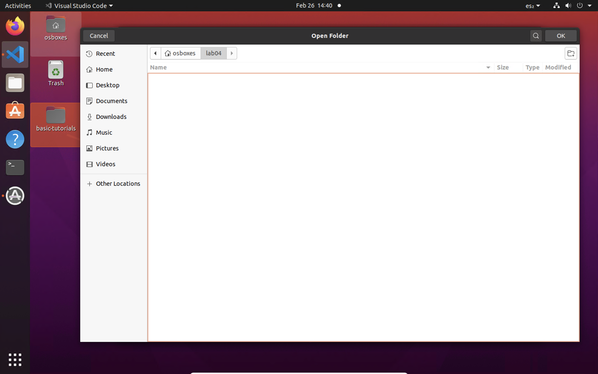

# Creando un Contrato con Lógica mas Avanzada

## 1 - Creando un nuevo proyecto

Para esta práctica debemos crear un nuevo proyecto, por este motivo vamos a nuestro menú de archivo y seleccionamos abrir un nuevo folder


En la ventana de seleccion de carpetas, damos click sobre el boton que parece un folder en la parte superior derecha y en el díalogo que aparece escribiremos __Lab04__



Finalmente esto nos deja en la carpeta recien creada y ahora seleccionamos el boton de __Ok__ que aparece en la parte superior extrema derecha



Finalmente seguiremos los mismos pasos que en las prácticas pasadas para crear un contrato inteligente sin embargo ahor en lugar de usar el nombre por omisión __MyAsset__ ahora usaremos el nombre __Commodity__

## 2 - Esitando el archivo de commodity.ts

Primero procedemos a editar el archivo __commodity.ts__ y cambiaremos la definición por omisión del activo por la siguiente

```javascript
import { Object, Property } from 'fabric-contract-api';

@Object()
export class Commodity {

    @Property()
    public docType: string;
    @Property()
    public description: string;
    @Property()
    public mainExchange: string;
    @Property()
    public quantity: number;
    @Property()
    public owner: string;
}
```
¿Que puedes ver distinto y que para que asumes que sirve cada parte? Ahora salva el archivo

## 3 - Editando el contrato inteligente

Ahora editaremos el contrato inteligente en el archivo __commodity-contract.ts__ dejando el siguiente código fuente:

```javascript
/*
 * SPDX-License-Identifier: Apache-2.0
 */

import { Context, Contract, Info, Returns, Transaction } from 'fabric-contract-api';
import { Commodity } from './commodity';

@Info({title: 'CommodityContract', description: 'My Smart Contract' })
export class CommodityContract extends Contract {

    @Transaction(false)
    @Returns('boolean')
    public async commodityExists(ctx: Context, commodityId: string): Promise<boolean> {
        const data: Uint8Array = await ctx.stub.getState(commodityId);
        return (!!data && data.length > 0);
    }

    @Transaction(false)
    @Returns('string')
    public async getCurrentId(ctx: Context): Promise<string>{
        return (ctx.clientIdentity.getID());
    }

    @Transaction()
    public async sellCommodity(ctx: Context, newOwner: string, commodityId:string):Promise<void>{
        const commodity = await this.readCommodity(ctx, commodityId);
        if (commodity == null) {
            throw new Error(`The commodity ${commodityId} doesn't exists`);
        }
        const currentId = await this.getCurrentId(ctx);
        if(commodity.owner !== currentId){
            throw new Error(`You are not the owner of ${commodityId}`);
        }
        commodity.owner = newOwner;
        const buffer: Buffer = Buffer.from(JSON.stringify(commodity));
        await ctx.stub.putState(commodityId, buffer);
    }

    @Transaction()
    public async createCommodity(ctx: Context, commodityId: string, description: string, mainExchange: string, quantity: number): Promise<void> {
        const exists: boolean = await this.commodityExists(ctx, commodityId);
        if (exists) {
            throw new Error(`The commodity ${commodityId} already exists`);
        }
        const commodity: Commodity = new Commodity();
        commodity.docType = "commodity";
        commodity.description = description;
        commodity.mainExchange = mainExchange;
        commodity.owner = ctx.clientIdentity.getID();
        commodity.quantity = quantity;
        const buffer: Buffer = Buffer.from(JSON.stringify(commodity));
        await ctx.stub.putState(commodityId, buffer);
    }

    @Transaction(false)
    @Returns('Commodity')
    public async readCommodity(ctx: Context, commodityId: string): Promise<Commodity> {
        const exists: boolean = await this.commodityExists(ctx, commodityId);
        if (!exists) {
            throw new Error(`The commodity ${commodityId} does not exist`);
        }
        const data: Uint8Array = await ctx.stub.getState(commodityId);
        const commodity: Commodity = JSON.parse(data.toString()) as Commodity;
        return commodity;
    }
}
```
## 4 - Ejercicio y discusión

Primero discutiremos lo que hace cada una de estas funciones y acto seguido, crearemos nuevas identidades y realizaremos algunas pruebas